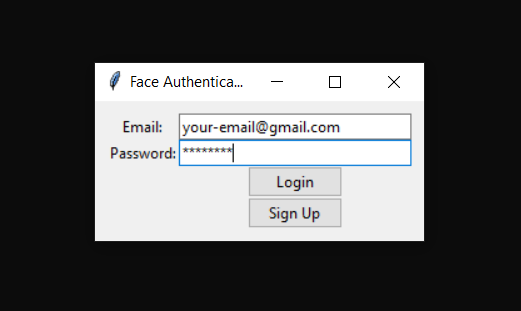
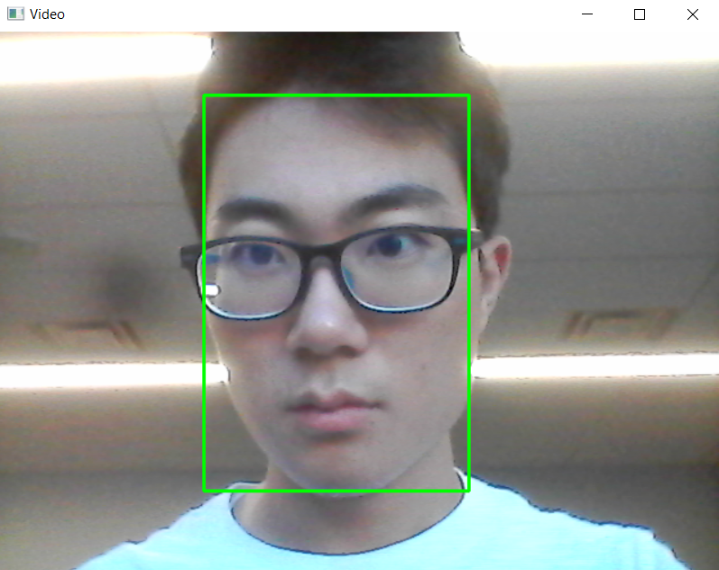
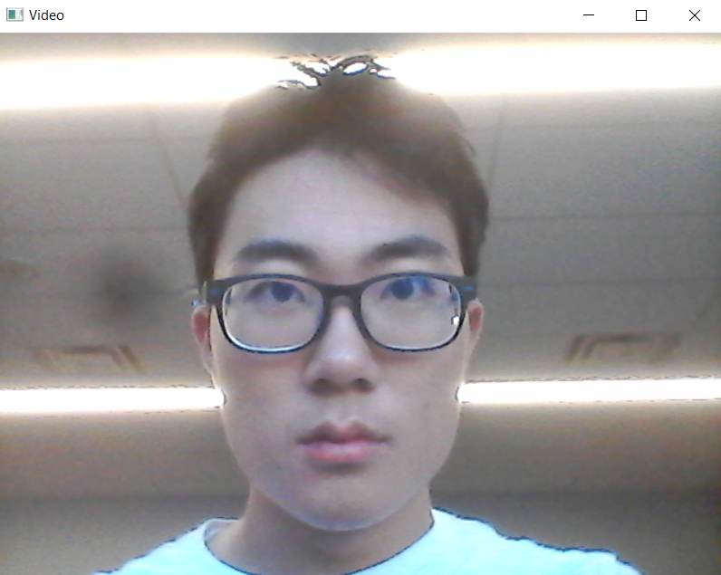
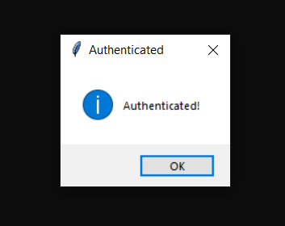

# Face Detection Authenticator

- A face detection authenticator system built using OpenCV and Tkinter.

> Sign-up/Login

> Train (takes 5~10s)

> Wait for Authentication (takes <1s)

> Authentication Successful

> Guide

- Sign-up and login.
- Train the model. OpenCV will take 100 photos of you. The trained model is stored under `validator_models/` folder.
- Authenticate. OpenCV will take a photo of you then the program will run the face detection model, if the confidence level is below 100% (lower number means higher confidence), then the user will be authenticated. If not, the authentication will be rejected.
- The photos are not stored, however the weights of the trained models will be stored locally.
